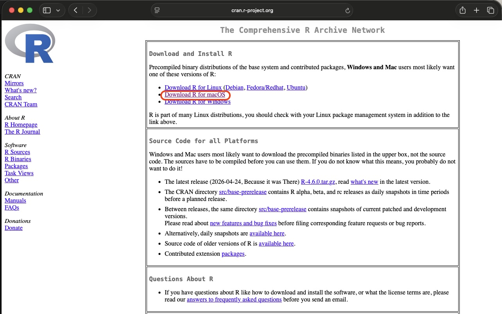
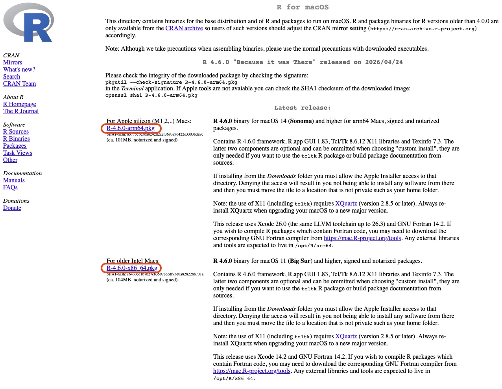
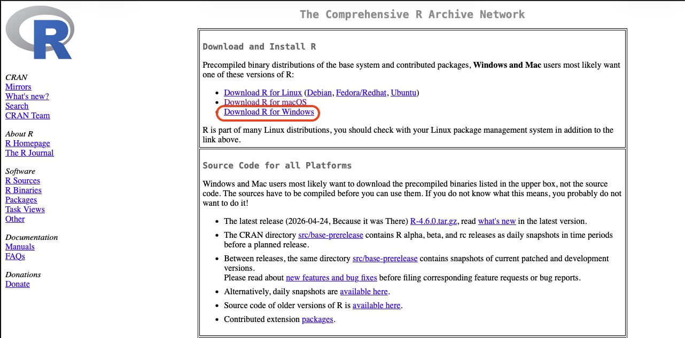
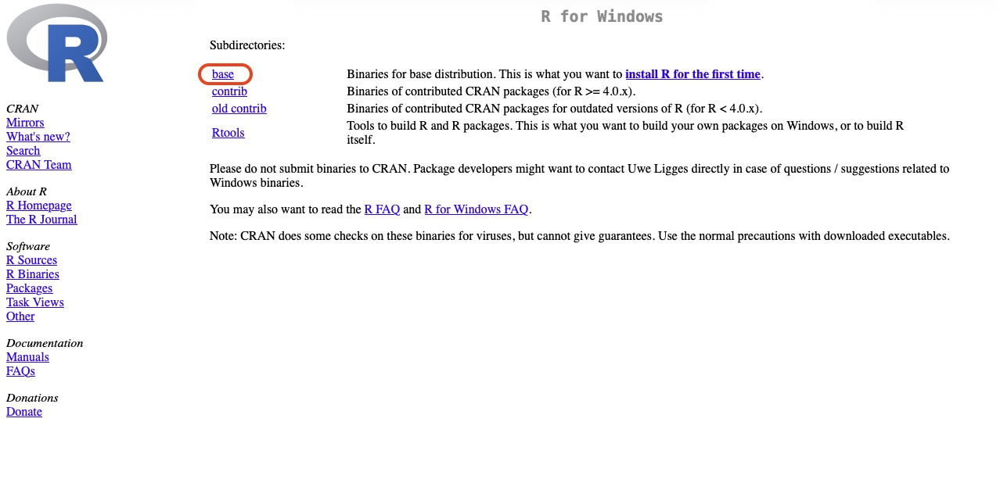
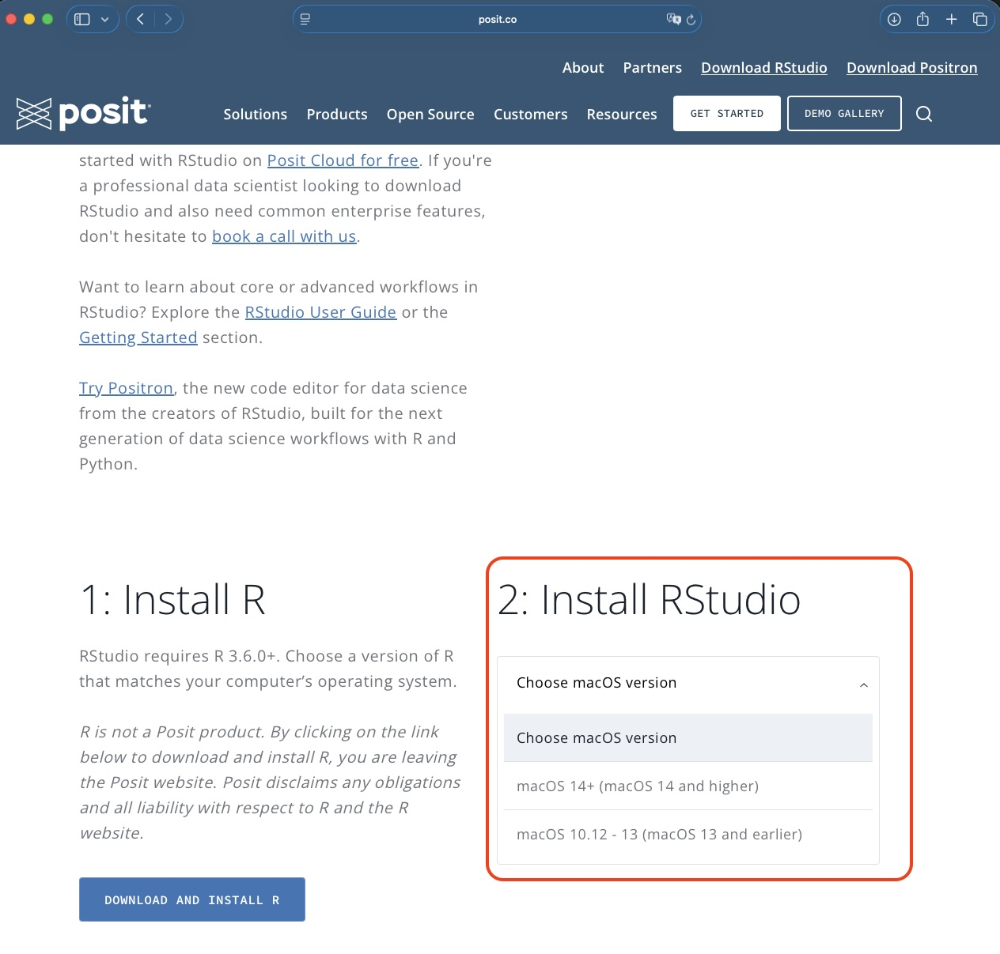
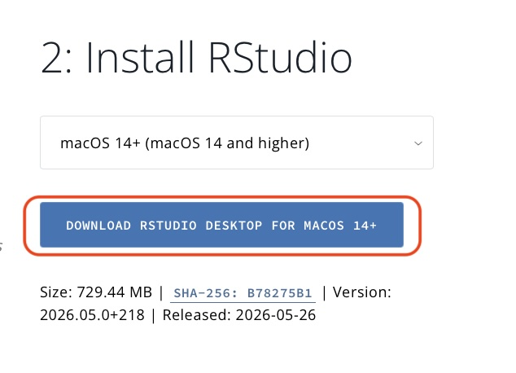

# Install R and RStudio

Before starting the tutorials, you need to install two programs:

1. **R** — the programming language we will use.
2. **RStudio Desktop** — an easier interface for writing and running R code.

> **Important:** Install **R first**, then install **RStudio**.

---

## Install Links

- [R download](https://cran.r-project.org/) — available for Windows, Mac, and Linux
- [RStudio Desktop download](https://posit.co/download/rstudio-desktop) — available for Windows, Mac, and Linux

---

# Install R

## Mac

1. Go to the R download page:

   [https://cran.r-project.org/](https://cran.r-project.org/)

2. Click:

   ```
   Download R for macOS
   ```


   
3. Download the latest .pkg installer.

The file name will look something like:

```
R-4.x.x-arm64.pkg
```
or 
```
R-4.x.x.pkg
```


Choose the appropriate installer for your Mac (M1/M2 or Intel).

4. Open the downloaded .pkg file and follow the installation instructions.
5. When the installation is complete, you can verify that R is installed by opening the Terminal and typing:
```bash
R --version
```
You should see the version of R that you installed.

## Windows
1. Go to the R download page:

   [https://cran.r-project.org/](https://cran.r-project.org/)  
2. Click:

   ```
   Download R for Windows
   ```



3. Click:

   ```
   base
   ```



4. Click the link to download the latest version of R (e.g., R-4.x.x-win.exe).
5. Open the downloaded .exe file and follow the installation instructions.

# Install RStudio
After installing R, install RStudio Desktop.    

## MAC
1. Go to the RStudio Desktop download page:

[https://posit.co/download/rstudio-desktop](https://posit.co/download/rstudio-desktop)

2. Click `Install Rstudio` and choose the Mac version.



3. Click the `DOWNLOAD RSTUDIO DESKTOP FOR MACOS ++` button.


4. Open the downloaded .dmg file from your Downloads folder.

5. Drag the RStudio icon into the Applications folder.

6. Open RStudio from your Applications folder.

## Windows / PC
1. Go to the RStudio Desktop download page:

[https://posit.co/download/rstudio-desktop](https://posit.co/download/rstudio-desktop)

2. Download the Windows installer.

The file name will look something like:

```
RStudio-202x.xx.x-xxx.exe
```

Open the downloaded .exe file.

4. Follow the installation steps using the default options.

5. Open RStudio from the Start Menu.

###  Alternatively, you can directly download the Windows installer using this link:

[https://download1.rstudio.org/electron/windows/RStudio-2026.05.0-218.exe](https://download1.rstudio.org/electron/windows/RStudio-2026.05.0-218.exe)

The file name will look something like:

```
RStudio-202x.xx.x-xxx.exe
```

1. Open the downloaded .exe file.

2. Follow the installation steps using the default options.

3. Open RStudio from the Start Menu.


# Setup R and Rmd files to be opened in RStudio
After installing R and RStudio, you may want to set up your computer so that R and Rmd files automatically open in RStudio when you double-click them.

## Mac
1. Find an R or Rmd file on your computer (e.g., in your Downloads folder).
2. Right-click the file and select **Get Info**.
3. In the "Get Info" window, find the "Open with:" section.
4. Click the dropdown menu and select **RStudio**.
5. Click the **Change All...** button to apply this setting to all R or Rmd files.
6. Confirm the change when prompted.   

## Windows
1. Find an R or Rmd file on your computer (e.g., in your Downloads
folder).
2. Right-click the file and select **Open with > Choose another app**.
3. In the "How do you want to open this file?" window, select **RStudio**.
4. Check the box that says **Always use this app to open .R/.Rmd files**.
5. Click **OK** to apply the change.         


