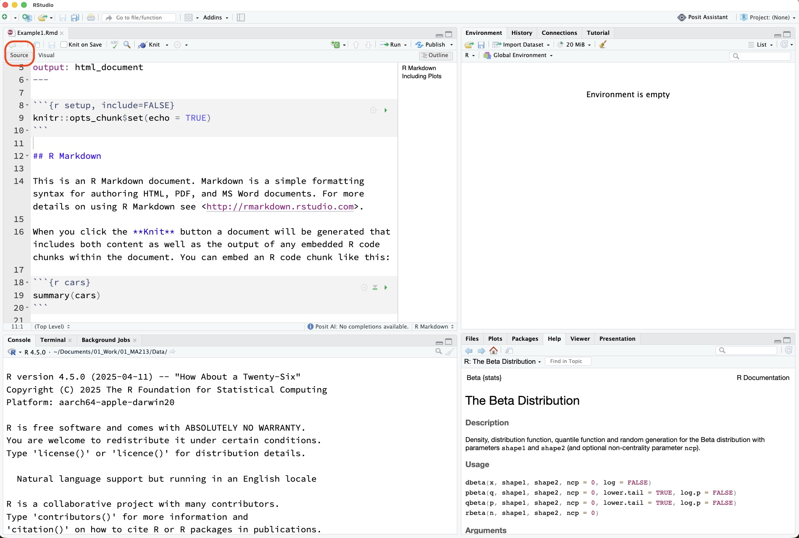
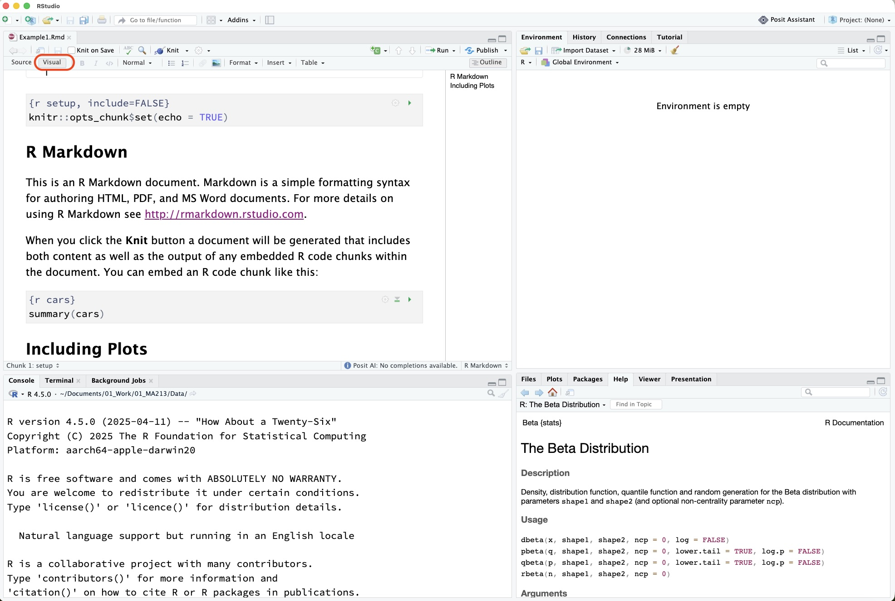
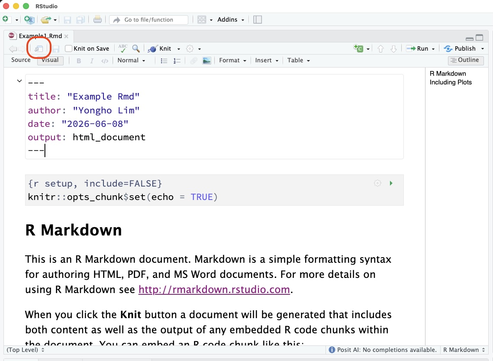
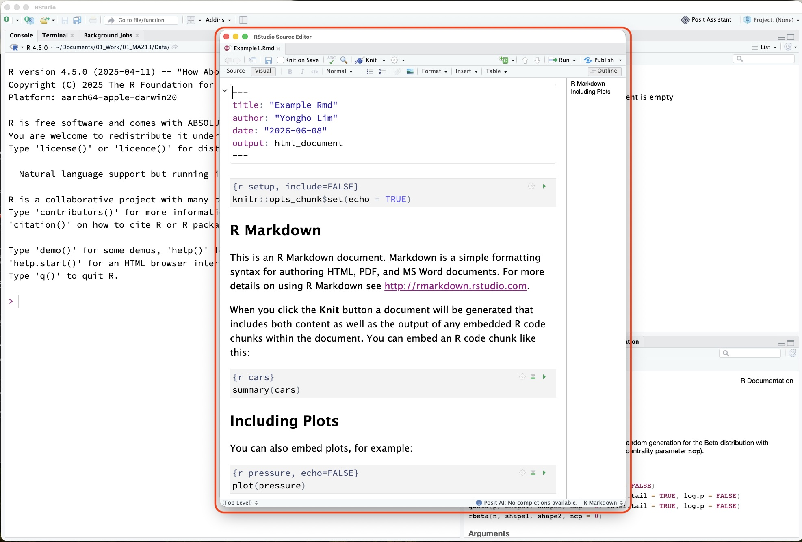

# 3. What is an R Markdown / Quarto Document?

So far, we have used an R script to write code.

Now we will learn about documents that combine:

- Regular writing
- R code
- Results
- Graphs

These documents are useful for creating reports.

## What is a Reproducible Report?

A **reproducible report** combines your explanation and your code in one place.

This is helpful because someone else can see:

1. What question you asked.
2. What code you used.
3. What results you got.
4. How you explained those results.

::: {.callout-tip}
## Tip

A reproducible report helps you avoid copying and pasting results by hand.
:::

## Comparing `.R`, `.Rmd`, and `.qmd` Files

| File Type | Name | What It Is Used For |
|---|---|---|
| `.R` | R script | Writing and saving R code |
| `.Rmd` | R Markdown document | Combining text, R code, and output |
| `.qmd` | Quarto document | A newer format for reports, websites, slides, and more |

## What is R Markdown?

**R Markdown** is a document format that lets you combine writing, code, and results.

R Markdown files usually end with:

```text
.Rmd
```

R Markdown has been widely used in many statistics and data science courses.

## What is Quarto?

**Quarto** is a newer tool for creating documents that include code and results.

Quarto files usually end with:

```text
.qmd
```

With Quarto, you can create:

- HTML webpages
- PDF documents
- Word documents
- Slides
- Websites

This guide is written as a Quarto website.

::: {.callout-note}
## Beginner Note

You do not need to memorize all the differences between R Markdown and Quarto right now.

For this course, focus on this idea:

> A Quarto document lets you write explanations, run code, and show results in one file.
:::

## Parts of a Rmd /Quarto Document

A simple Quarto document usually has:

1. A title section at the top.
2. Regular text.
3. Code chunks.

## Example Title Section

At the top of a Rmd/Quarto file, you may see something like this:

```yaml
---
title: "My First Rmd Document"
author: "Your Name"
format: html
---
```

This part is called the **YAML header**.

You do not need to write complicated YAML right now. It simply tells Rmd basic information about the document.

## Regular Text

You can type normal sentences in a Rmd document.

For example:

```markdown
This report shows my first analysis in R.
```

## Code Chunks

A **code chunk** is a special section where R code can be run.

In a real Quarto document, an R code chunk has three parts:

1. A starting line with three backticks followed by `{r}`.
2. One or more lines of R code.
3. An ending line with three backticks.

For example, a code chunk that calculates `2 + 2` would look like this in your `.Rmd` file:

```text
Line 1: three backticks followed by {r}
Line 2: 2 + 2
Line 3: three backticks
```

When you render the document, Quarto runs the code and shows the result.

::: {.callout-tip}
## Tip

Code chunks are different from regular text.

Regular text explains your work.

Code chunks run R code.
:::

## A Simple Quarto Document

Here is the structure of a small Quarto document:

```text
---
title: "My First Quarto Document"
author: "Your Name"
format: html
---

# My First Quarto Document

This is my first Quarto document.

Here is a simple calculation.

Then add an R code chunk that contains:

2 + 2

After rendering, the answer appears below the code.
```

In your actual `.qmd` file, the R code chunk would start with three backticks followed by `{r}`, and end with three backticks.

## What is Rendering?

To **render** a document means to turn it into a finished report.

For example, In Quarto and R Markdown, `.qmd` or `.Rmd` file can turn into:

- an HTML webpage,
- a PDF document,
- or a Word document.

In RStudio, you can usually click the **Render** button.

## Interface in Rmd/Quarto Documents

When you open a `.Rmd` or `.qmd` file in RStudio, you will see:
### Source View
Click **Source** to see the raw text and code in your document.



### Visual View
Click **Visual** to see a more polished version of your document, with formatted text and rendered code chunks.



### Show in a new window

Click **Show in new window** to see the rendered document in a separate window.




