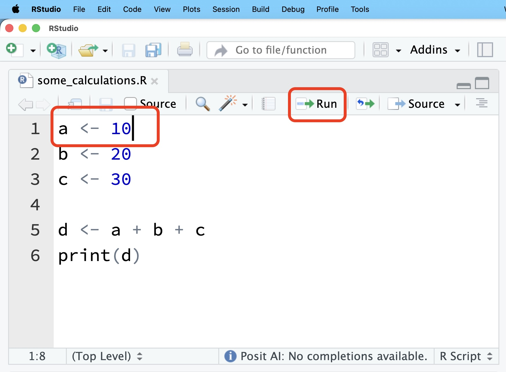
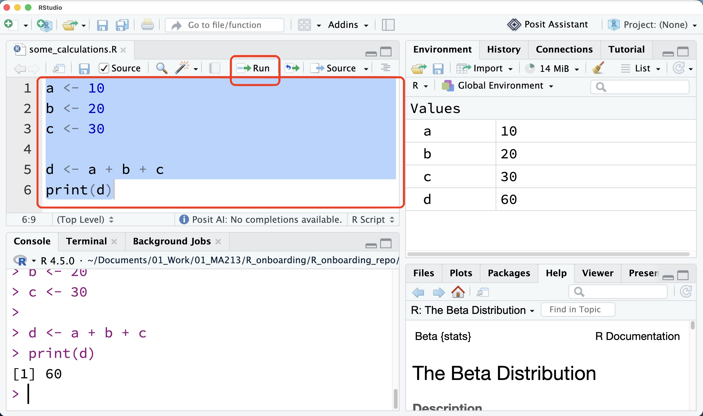
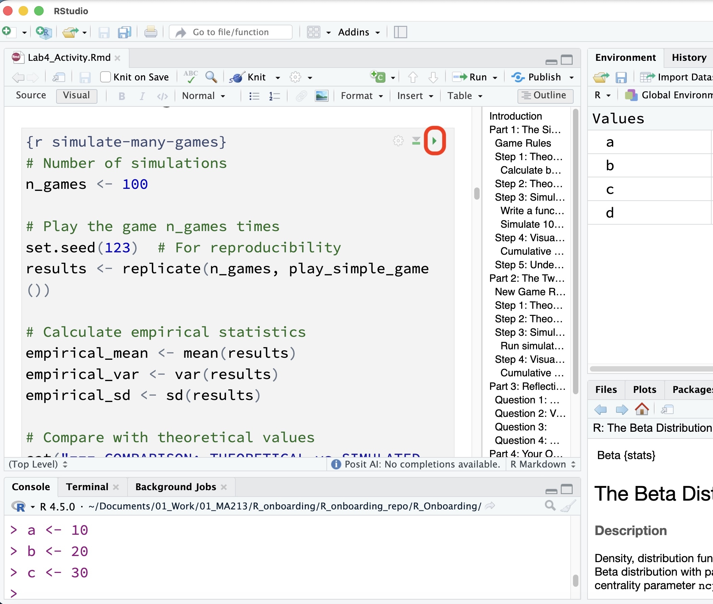

# 4. Running Code in RStudio

Writing code is only the first step. You also need to run it.

In RStudio, there are several ways to run R code.

## Method 1: Use the Run Button

If your cursor is on a line of code, you can click the **Run** button.



Example:

```{r}
3 + 4
```


## Method 2: Use Ctrl + Enter or Cmd + Enter

You can also use a keyboard shortcut.

| Computer | Shortcut |
|---|---|
| Windows | `Ctrl + Enter` |
| Mac | `Cmd + Enter` |

This runs the current line of code.

::: {.callout-tip}
## Tip

Keyboard shortcuts make your work faster once you get used to them.
:::

## Method 3: Run Selected Lines

You can highlight several lines of code and run only those lines.

Try highlighting this code:

```{r}
x <- 10
y <- 5
x + y
```


Then press:

- `Ctrl + Enter` on Windows
- `Cmd + Enter` on Mac

## Method 4: Run the Highlighted Script

To run the highlighted script, you can:

1. Open your `.R` file.
2. Highlight the code you want to run.
3. Click **Run**.
4. RStudio will run the highlighted code from top to bottom.



::: {.callout-warning}
## Important

R runs code from top to bottom.

If a later line depends on an earlier line, make sure the earlier line has already been run.
:::

## Example: Order Matters

This works because `height` is created before it is used:

```{r}
height <- 65
height + 2
```


This would cause an error if `height` had not already been created:

```r
height + 2
```

## Running Code in a Rmd / Quarto Document

In a Rmd or Quarto document, code usually appears inside a code chunk.

A code chunk looks like this:


```{r}
2 + 2
```


You can run code chunks using the small green play button near the chunk.



::: {.callout-tip}
## Tip

When you render a Rmd / Quarto document, R runs the code chunks from top to bottom.
:::

## Running Selected Code vs. Rendering

Running selected code is useful when you are practicing or testing something.

Rendering is useful when you want to create the final document.

| Action | What It Does |
|---|---|
| Run one line | Runs only the current line |
| Run selected lines | Runs only the code you highlight |
| Source script | Runs the whole `.R` script |
| Render document | Runs the whole `.qmd` document and creates output |

::: {.callout-note}
## Beginner Note

If something works when you run one line but fails when you render, it may mean your document is missing an earlier line of code.

Remember: Quarto starts fresh and runs the document from top to bottom.
:::

## Troubleshooting Common Errors

### Error: object not found

You may see an error like:

```text
Error: object 'quiz_score' not found
```

This means R does not know what `quiz_score` is.

Usually this happens because:

- You did not create the object yet.
- You misspelled the object name.
- You restarted R and need to run earlier code again.

Example mistake:

```r
quiz_score + 5
```

Fix:

```r
quiz_score <- 90
quiz_score + 5
```

### Error: unexpected symbol

You may see:

```text
Error: unexpected symbol
```

This often means there is a typing mistake.

For example:

```r
my score <- 90
```

R does not like spaces in object names.

Use:

```r
my_score <- 90
```

### Error: could not find function

You may see:

```text
Error: could not find function "some_function"
```

This may mean:

- The function name is misspelled.
- You forgot to load a package.
- The package is not installed.

For now, check your spelling first.

## Try It Yourself

::: {.callout-note}
## Practice

Create a new script and type:

```r
a <- 12
b <- 3
a / b
```

Try running the code using:

1. The Run button.
2. The keyboard shortcut.
3. Highlighting all three lines.
4. The Source button.
:::

## Practice: Find the Mistake

Look at this code:

```r
exam score <- 85
exam_score + 5
```

This code has two problems.

Try to fix it before looking below.

Corrected version:

```r
exam_score <- 85
exam_score + 5
```

The first problem was the space in `exam score`.

The second problem was that the object name was not written the same way both times.

::: {.callout-warning}
## Common Mistake

R is very exact.

These names are different to R:

```r
score
Score
quiz_score
quizscore
```
:::

## Check Your Understanding

Answer these questions:

1. What button can you use to run one line of code?
2. What keyboard shortcut runs the current line?
3. Why does the order of code matter?
4. What does “object not found” usually mean?

## Summary

In this section, you learned how to:

- Run one line of code.
- Run selected lines of code.
- Run an entire script.
- Run code chunks in a Quarto document.
- Understand a few common error messages.

You are now ready to work with files and folders.